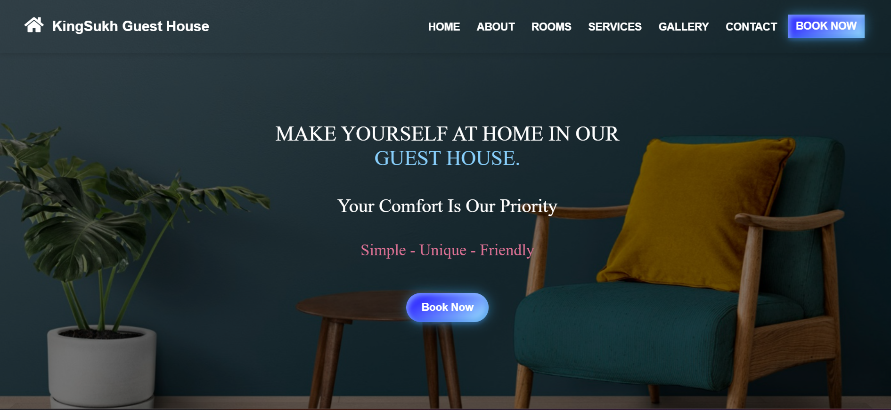

<!-- <h1>KingSukh Guest House<h1>

<h2>Welcome to the KingSukh Guest House project repository. This website serves as an interactive platform to showcase the rooms, services, and contact information for the guest house.</h2>

<h2>Features:</h2>

<li><strong>Responsive Design</strong>: Optimized for Desktop Devices.</li>

<li><strong>Interactive Sections</strong>:</li> 
<ul>
        <ul>
        <li>Carousel for showcasing images.</li>
        <li>Smooth scrolling for navigation.</li>
        <li>Form validation for user input.</li>
        </ul>
</ul>
<li><strong>Animations</strong>: Includes hover effects, transition animations, and interactive gallery.</li>

<li><strong>Modern Design</strong>: Use of linear gradients, box shadows, and modern UI components.</li>

<li><strong>Accessible Navigation</strong>: Navbar and links for easy user interaction.</li>

<h2>File Structure:</h2>

<h2>HTML Files:</h2>

<li>index.html: The main structure of the website including sections for Home, About Us, Rooms, Services, Gallery, Contact, and Footer.</li>

<h2>CSS Files:</h2>

<li>main.css: Styles the layout and design of the webpage.</li>
<li>Manages typography, colors, and responsive behavior.</li>
<li>Includes animation keyframes and hover effects for dynamic UI.</li>

<h2>JavaScript Files:</h2>

<li>index.js: Contains JavaScript functionalities such as:</li> 
<ul>
    <ul>
    <li>Navbar scroll effects.</li>
    <li>Smooth scrolling.</li>
    <li>Form validation.</>
    <li>Carousel controls.</li>
    </ul>
</ul>

<h2>Sections Overview:</h2>

1. Navbar:

<ul>
    <ul>
        <li>Fixed at the top with smooth scroll functionality.</li>
        <li>Collapsible menu for smaller screens.</li>
        <li>Includes a call-to-action button for booking rooms.</li>
    </ul>
</ul>
 

2. Carousel:

<ul>
    <ul>
        <li>A slideshow of guest house images, transitioning every 2 seconds.</li>
    </ul>
</ul>
 

3. Hero Section:

<ul>
    <ul>
        <li>Welcome message with dynamic call-to-action buttons.</li>
    </ul>
</ul>
 

4. About Us:

<ul>
    <ul> 
        <li>Overview of the guest house's features and nearby attractions.</li>
        <li>Includes buttons for booking, address redirection, and calling the contact number.</li>
    </ul>
</ul>
 

5. Rooms:

<ul>
    <ul>
        <li>Grid layout displaying various room options with descriptions, images, and pricing.</li>
    </ul>
</ul>
 

6. Services:

<ul>
    <ul>
        <li>Showcases the services provided with icons, titles, and short descriptions.</li>
    </ul>
</ul>
 

7. Gallery:

<uL>
    <ul>
        <li>Displays images in a grid with zoom effects.</li>
        <li>Clickable images open in a lightbox for better viewing.</li>
    </uL>
</ul>
 

8. Contact:

<ul>
    <ul>
        <li>A form for users to send messages.</li>
        <li>Interactive icons for phone, email, and social media links.</li>
        <li>Google Maps iframe for location display.</li>
    </ul>
</ul>
 

9. Footer:

<ul>
    <ul>
        <li>Quick links, contact details, and social media links.</li>
    </ul>
</ul>
 

<h2>Technologies Used:</h2>
<ul>
    <ul>
    <li>HTML5: For semantic structure.</li>
    <li>CSS3: For responsive and modern styling.</li>
    <li>JavaScript: For dynamic functionalities and validations.</li>
    <li>Bootstrap 5: For layout and responsive components.</li>
    <li>Font Awesome: For icons.</li>
    </ul>
</ul>
 -->

# KingSukh Guest House

Welcome to the KingSukh Guest House project repository! This interactive website showcases the rooms, services, and contact information for the guest house.

## Table of Contents
- [Features](#features)
- [File Structure](#file-structure)
- [Sections Overview](#sections-overview)
- [Technologies Used](#technologies-used)
- [Getting Started](#getting-started)
- [Screenshots](#screenshots)
- [Contributing](#contributing)

## Features
- **Responsive Design**: Optimized for desktop devices.
- **Interactive Sections**:
  - Carousel for showcasing images.
  - Smooth scrolling for navigation.
  - Form validation for user input.
- **Modern UI Elements**:
  - Linear gradients, box shadows, and hover animations.
  - Accessible navigation with a responsive navbar.

## File Structure

- index.html: Main webpage structure.
- main.css: Styles for layout, typography, and animations.
- index.js: JavaScript for smooth scrolling, carousel, and form validation.

## Sections Overview
- Navbar: Fixed with smooth scroll and responsive menu.
- About Us: Overview of the guest house's features and nearby attractions.
- Rooms: Grid layout for room details, images, and pricing.
- Services: Showcases the services provided with icons, titles, and short descriptions.
- Gallery: Displays images in a grid with zoom effects.
- Contact: Interactive form with Google Maps integration.

## Technologies Used
- HTML5, CSS3, JavaScript
- Bootstrap 5 for responsive layout
- Font Awesome for icons

## Getting Started
1. Clone the repository: 
<code>git clone https://github.com/your-username/kingsukh-guesthouse.git</code> 

2. Open index.html in a browser to view the project.

## Screenshots

## Contributing
### Contributions are welcome! Follow the steps below:
1. Fork the repository.
2. Create a new branch (git checkout -b feature-branch).
3. Commit your changes (git commit -m "Add feature").
4. Push the branch (git push origin feature-branch).
5. Open a pull request.